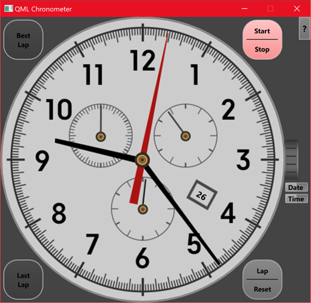
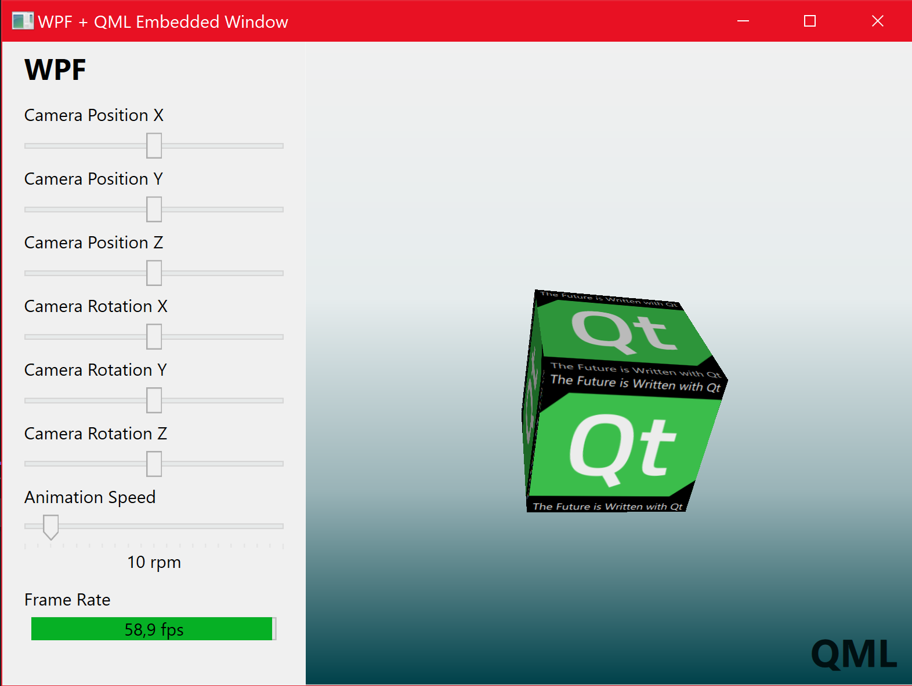
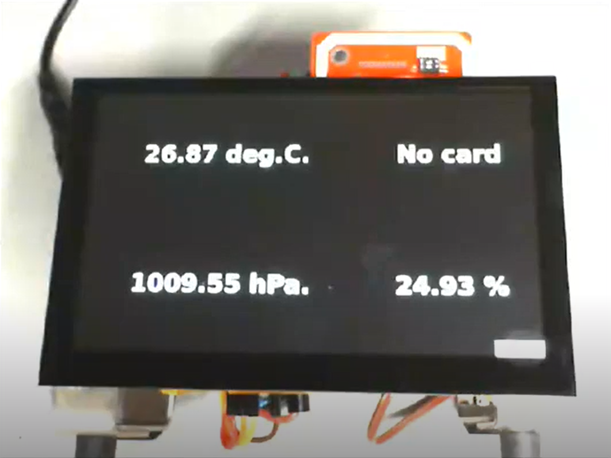

<!--************************************************************************************************
 Copyright (C) 2023 The Qt Company Ltd.
 SPDX-License-Identifier: LicenseRef-Qt-Commercial OR LGPL-3.0-only OR GPL-2.0-only OR GPL-3.0-only
*************************************************************************************************-->


# Qt / .NET

The Qt/.NET library allows Qt applications to use .NET code assets, by providing a
[custom runtime host](https://learn.microsoft.com/en-us/dotnet/core/tutorials/netcore-hosting)
for managed assemblies, through which managed code can be invoked from C++.

* [Quick Start](#quick-start)
* [Requirements](#requirements)
* [Build](#build)
* [Deploy](#deploy)
* [Examples](#examples)
    * [QML UI for a .NET module](#qml-ui-for-a-net-module)
    * [QML window embedded in WPF application](#qml-window-embedded-in-wpf-application)
    * [IoT sample application with Qt and Azure](#iot-sample-application-with-qt-and-azure)
* [Getting started](#getting-started)
    * [Calling .NET static methods](#calling-net-static-methods)
    * [Handling .NET exceptions](#handling-net-exceptions)
    * [Creating .NET object](#creating-net-objects)
    * [Calling instance methods](#calling-instance-methods)
    * [Writing C++ wrapper classes for .NET types](#writing-c-wrapper-classes-for-net-types)
    * [Emitting Qt signals from .NET events](#emitting-qt-signals-from-net-events)
    * [Using .NET objects in QML](#using-net-objects-in-qml)
    * [Using QML in a WPF application](#using-qml-in-a-wpf-application)

## Quick Start

1. Install [requirements](#requirements).
2. Clone repository
3. Open solution file `qtdotnet.sln`.
4. Press `F5`.

The ["Embedded Window"](#qml-window-embedded-in-wpf-application) example is then built and started.

## Requirements

Qt/.NET requires Qt6, as well as .NET version 6 or greater.

The minimum required version of Visual Studio is VS 2019 (recommended: VS 2022).

Using the [Qt Visual Studio Tools](https://doc.qt.io/qtvstools/index.html) extension is recommended,
but not required. However, the sample code provided in the `examples` directory does require the Qt
VS Tools extension, as well as a Qt6 installation set as default Qt version.

## Build

To use the Qt/.NET library, the `include` directory must be in the include path. Qt/.NET is a
header-only library, therefore no link time requirements exist.

## Deploy

At run time, the adapter assembly (`Qt.DotNet.Adapter.dll`) must be present at a location accessible
by the .NET assembly locating services. This can be the directory of the application binary.

## Examples

### QML UI for a .NET module

An example of a Qt application with a QML front-end for a .NET "business logic" module can be found
in the [`Chronometer`](examples/Chronometer) sample project.

<sup><br>
<i><code>Chronometer</code> example application.</i></sup>

```c#
public double ElapsedSeconds
{
    get => elapsedSeconds;
    private set => SetProperty(ref elapsedSeconds, value, nameof(ElapsedSeconds));
}
```

```cpp
class QChronometer : public QObject, public QDotNetObject
{
    Q_OBJECT
    Q_PROPERTY(double elapsedSeconds READ elapsedSeconds NOTIFY elapsedSecondsChanged)
    ...
    Q_DOTNET_OBJECT(QChronometer, "WatchModels.Chronometer, ChronometerModel");
    ...

    void handleEvent(const QString &eventName, QDotNetObject &sender, QDotNetObject &args) override
    {
        ...
        const auto propertyChangedEvent = args.cast<QDotNetPropertyEvent>();
        ...
        if (propertyChangedEvent.propertyName() == "ElapsedSeconds")
            emit elapsedSecondsChanged();
        ...
    }
}
```

```qml
Image {
    id: secondsHand;
    source: "second_hand.png"
    transform: Rotation {
        origin.x: 250; origin.y: 250
        angle: chrono.elapsedSeconds * 6
        Behavior on angle {
            SpringAnimation { spring: 3; damping: 0.5; modulus: 360 }
        }
    }
}
```

Full source code in [`examples/Chronometer`](examples/Chronometer).

### QML window embedded in WPF application

The [`EmbeddedWindow`](examples/EmbeddedWindow) example illustrates how to embed a QML window
within a WPF application. The WPF and QML UI stacks run on separate threads of the same process.

<sup><br><i><code>EmbeddedWindow</code>
example application.</i></sup>

```qml
window.afterFrameEnd.connect(
    function() {
        var t = Date.now();
        if (t0 == 0) {
            t0 = t;
            n = 1;
        } else {
            var dt = t - t0;
            if (dt >= 1000) {
                mainWindow.framesPerSecond = (1000 * n) / dt;
                n = 0;
                t0 = t;
            } else {
                n++;
            }
        }
    });
```

```cpp
void MainWindow::setFramesPerSecond(double fps)
{
    method("set_FramesPerSecond", d->fnSetEmbeddedFps).invoke(*this, fps);
}
```

```c#
public double FramesPerSecond
{
    get => WpfThread(() => FpsValue.Value);
    set
    {
        WpfThread(() =>
        {
            if (value <= FpsValue.Maximum)
                FpsValue.Value = value;
            FpsLabel.Text = $"{value:0.0} fps";
        });
    }
}
```

Full source code in [`examples/EmbeddedWindow`](examples/EmbeddedWindow).

### IoT sample application with Qt and Azure

This example project illustrates how to integrate Qt applications with .NET in a non-Windows setting
like the [Raspberry Pi OS](https://www.raspberrypi.com/software/).

<sup><br><i><code>QtAzureIoT</code>
example application running on a Raspberry Pi device.</i></sup>

```cpp
class Backoffice : public QDotNetObject
{
public:
    Q_DOTNET_OBJECT_INLINE(Backoffice, "QtAzureIoT.Device.Backoffice, DeviceToBackoffice");
    Backoffice() : QDotNetObject(getConstructor<Backoffice>().invoke(nullptr))
    {}
    void setTelemetry(QString name, double value)
    {
        getMethod("SetTelemetry", fnSetTelemetryDouble).invoke(*this, name, value);
    }
    ...
};

class SensorData : public QObject, public QDotNetObject, public QDotNetObject::IEventHandler
{
    Q_OBJECT
        Q_PROPERTY(double temperature READ temperature NOTIFY temperatureChanged)
        ...
public:
    Q_DOTNET_OBJECT_INLINE(SensorData, "QtAzureIoT.Device.SensorData, SensorData");
    SensorData() : QDotNetObject(getConstructor<SensorData>().invoke(nullptr))
    {
        subscribeEvent("PropertyChanged", this);
    }
    double temperature() const
    {
        return getMethod("get_Temperature", fnGet_Temperature).invoke(*this);
    }
    ...
signals:
    void temperatureChanged();
    ...
};

...

QObject::connect(&sensor, &SensorData::temperatureChanged,
    [&backoffice, &sensor]()
    {
        backoffice.setTelemetry("temperature", sensor.temperature());
    });

...
```

Full source code in [`examples/QtAzureIoT`](examples/QtAzureIoT).


## Getting started

### Calling .NET static methods

The following code uses Qt/.NET to call the static method `Environment.GetEnvironmentVariable()`.

```cpp
QDotNetType environmentType = QDotNetType::find("System.Environment");
auto getEnvironmentVariable = environmentType.method<QString, QString>("GetEnvironmentVariable");
QString path = getEnvironmentVariable("PATH");
```

The `method()` function returns an instance of `QDotNetFunction<QString, QString>`. This type is a
specialization of the following template type:

```cpp
template<typename TResult, typename... TArg>
class QDotNetFunction {...};
```

This is a functor that encapsulates a call to a .NET function, where `TResult` is the return type,
and `TArg...` are the argument types.

The following shorthand form can also be used to call a .NET static method:

```cpp
QtDotNet::call<QString, QString>("System.Environment", "GetEnvironmentVariable", "PATH");
```

### Handling .NET exceptions

The `QDotNetFunction` type does not provide exception handling. If an exception is thrown during the
managed function call, the application will crash. To avoid this, use `QDotNetSafeMethod` instead.

```cpp
QDotNetSafeMethod<QString, QString> safeGetEnvironmentVariable
    = environment.method<QString, QString>("GetEnvironmentVariable");
try {
    path = safeGetEnvironmentVariable.invoke(nullptr, "PATH");
} catch (QDotNetException &e) {
    path = "<ERROR>";
}
```

There is a performance cost to using `QDotNetSafeMethod`. If a .NET call is guaranteed not to throw
an exception, using `QDotNetFunction` will provide better performance.

### Creating .NET objects

To create a .NET object, a reference to a constructor method must first be obtained. The constructor
method will return a `QDotNetObject` referencing the newly created managed object.

```cpp
auto newStringBuilder = QDotNetType::constructor("System.Text.StringBuilder");
QDotNetObject stringBuilder = newStringBuilder();
```

### Calling instance methods

With a `QDotNetObject`, it's possible to obtain a reference to, and then call an instance method of
the referenced object.

```cpp
auto append = stringBuilder.method<QDotNetObject, QString>("Append");
append("Hello");
append(" World!");
QString helloWorld = stringBuilder.toString(); //"Hello World!"
```

### Writing C++ wrapper classes for .NET types

To make it easier to create managed objects and calling their methods, it's possible to extend the
`QDotNetObject` class to write wrapper classes for .NET types used in Qt applications.

```cpp
class StringBuilder : public QDotNetObject
{
public:
    Q_DOTNET_OBJECT_INLINE(StringBuilder, "System.Text.StringBuilder");
    StringBuilder() : QDotNetObject(constructor<StringBuilder>().invoke(nullptr))
    { }
    StringBuilder append(const QString &str)
    {
        return method("Append", safeAppend).invoke(*this, str).cast<StringBuilder>();
    }
private:
    QDotNetSafeMethod<QDotNetObject, QString> safeAppend;
};

...

StringBuilder stringBuilder;
QString helloWorld;
try {
    stringBuilder.append("Hello").append(" World!");
    helloWorld = stringBuilder.toString(); //"Hello World!"
} catch (QDotNetException &e) {
    helloWorld = "<ERROR>";
}
```

### Emitting Qt signals from .NET events

A wrapper for a .NET type can also extend `QObject`, which will allow integration of managed
objects in a Qt application. This includes receiving notifications of .NET events and emitting
corresponding Qt signals.

```cpp
class Ping : public QObject, public QDotNetObject, public QDotNetObject::IEventHandler
{
    Q_OBJECT
public:
    Q_DOTNET_OBJECT_INLINE(Ping, "System.Net.NetworkInformation.Ping, System");
    Ping() : QDotNetObject(constructor<Ping>().invoke(nullptr))
    {
        subscribeEvent("PingCompleted", this);
    }
    void sendAsync(const QString &hostNameOrAddress)
    {
        method("SendAsync", safeSendAsync).invoke(*this, hostNameOrAddress, nullptr);
    }
signals:
    void pingCompleted(QString address, qint64 roundtripTime);
private:
    void handleEvent(const QString &evName, QDotNetObject &evSrc, QDotNetObject &evArgs) override
    {
        auto reply = evArgs.method<QDotNetObject>("get_Reply");
        auto replyAddress = reply().method<QDotNetObject>("get_Address");
        auto replyRoundtrip = reply().method<qint64>("get_RoundtripTime");
        emit pingCompleted(replyAddress().toString(), replyRoundtrip());
    }
    QDotNetSafeMethod<void, QString, QDotNetNull> safeSendAsync;
};

...

Ping ping;
bool waiting = true;
QObject::connect(&ping, &Ping::pingCompleted,
    [&waiting](QString address, qint64 roundtripMsecs)
    {
        qInfo() << "Reply from" << address << "in" << roundtripMsecs << "msecs";
        waiting = false;
    });
for (int i = 0; i < 4; ++i) {
    waiting = true;
    ping.sendAsync("www.qt.io");
    while (waiting)
        QCoreApplication::processEvents();
}

//// Console output:
// Reply from "199.60.103.31" in 18 msecs
// Reply from "199.60.103.31" in 14 msecs
// Reply from "199.60.103.31" in 13 msecs
// Reply from "199.60.103.31" in 12 msecs
```

### Using .NET objects in QML

The standard mechanism for property binding in .NET applications (for example, to bind data objects
with WPF UI specifications) requires that types implement the `INotifyPropertyChanged` interface,
through which they will be able to synchronize bound properties.

This mechanism can also be used to bind properties of .NET objects in QML, by handling property
change events and emitting corresponding property notification signals.

<blockquote>

<sub>Managed class implementing property change notifications:</sub>
```c#
public class Chronometer : INotifyPropertyChanged
{
    public double Hours
    {
        get { ... }
        private set
        {
            ...
            NotifyPropertyChanged("Hours");
        }
    }
    ...
}
```
</blockquote>

<blockquote>

<sub>Native wrapper with Qt properties mirroring those in the managed class:</sub>

```cpp
class QChronometer : public QObject, public QDotNetObject
{
    Q_OBJECT
    Q_PROPERTY(double hours READ hours NOTIFY hoursChanged)
    ...
public:
    Q_DOTNET_OBJECT(QChronometer, "WatchModels.Chronometer, ChronometerModel");
    ...
    double hours();
    ...
signals:
    void hoursChanged();
    ...
};
...
struct QChronometerPrivate : public QDotNetObject::IEventHandler
{
    ...
void handleEvent(const QString &eventName, QDotNetObject &sender, QDotNetObject &args) override
    {
        if (eventName != "PropertyChanged")
            return;
        if (args.type().fullName() != QDotNetPropertyEvent::FullyQualifiedTypeName)
            return;

        auto propertyChangedEvent = args.cast<QDotNetPropertyEvent>();
        if (propertyChangedEvent.propertyName() == "Hours")
            emit q->hoursChanged();
        ...
    }
}
...
QQmlApplicationEngine engine;
QChronometer chrono();
engine.rootContext()->setContextProperty("chrono", &chrono);
```
</blockquote>

<blockquote>

<sub>QML UI specification using properties of the .NET type:</sub>
```qml
...
Image {
    id: hoursHand;
    source: "hour_hand.png"
    transform: Rotation {
        origin.x: 249; origin.y: 251
        angle: 110 + (chrono.hours % 12) * 30
    }
}
...
```
</blockquote>

### Using QML in a WPF application

Qt/.NET can be used to integrate Qt in WPF applications. For example, it is possible to embed a QML
view inside a WPF window, as illustrated below.

<blockquote>

<sub>WPF main window, including a host panel where the QML view will be embedded:</sub>
```xml
<Window>
    <Grid>
        <Label x:Name="labelCoords" Content="WPF Window" />
        <WindowsFormsHost Name="EmbeddedAppHost">
            <wf:Panel Name="EmbeddedAppPanel" BackColor="#AAAAAA"/>
        </WindowsFormsHost>
    </Grid>
</Window>
```

</blockquote>

<blockquote>

<sub>QML view to embed in the WPF application:</sub>
```qml
Item {
    width: mainWindow.hostWidth
    height: mainWindow.hostHeight
    Rectangle {
        anchors.fill: parent
        color: "#AAAAFF"
        Text {
            id: coordinates
            text: "QML Window"
            ...
        }
    }
    ...
}
```
</blockquote>

Since both frameworks require ownership of an UI thread, they must run in separate threads. This
should not become an issue, as Qt is, by design, well suited for multi-threaded environments. In
particular, the signal-slot mechanism offers a robust means to integrate Qt and WPF wrappers across
multiple threads.

<blockquote>

<sub>Initialization of the WPF thread:</sub>
```c++
mainWindow = constructor<MainWindow>().invoke(nullptr);
mainWindow->setHostHandle(method<HwndHost>("get_HwndHost").invoke(mainWindow));
QtDotNet::call<void, MainWindow>("WpfApp.Program, WpfApp", "set_MainWindow", mainWindow);
QtDotNet::call<int>("WpfApp.Program, WpfApp", "Main");
```
</blockquote>

<blockquote>

<sub>Initialization of the QML thread:</sub>
```c++
embeddedWindow = QWindow::fromWinId((WId)mainWindow->hostHandle());
quickView = new QQuickView(qmlEngine, embeddedWindow);
quickView->setSource(QUrl(QStringLiteral("qrc:/main.qml")));
quickView->show();
```
</blockquote>

WPF events are handled by the MainWindow wrapper and converted to signals connected to the QML UI.
Simultaneously, signals from the QML UI connected to slots in the MainWindow wrapper will trigger
corresponding changes in the WPF UI.

<blockquote>

<sub>Native wrapper, including conversion of WPF events into signals:</sub>

```c++
class MainWindow : public QObject, public QDotNetObject
{
    Q_OBJECT
public:
    Q_DOTNET_OBJECT(MainWindow, "WpfApp.MainWindow, WpfApp");
...
signals:
    void mouseMove(double x, double y);
    void mouseLeave();
    void closed();
public slots:
    void embeddedMousePosition(const QString &source, double x, double y);
...
};

void handleEvent(const QString &evName, QDotNetObject &evSource, QDotNetObject &evArgs) override
{
    if (evName == "MouseMove") {
        const auto &mouseEvent = evArgs.cast<MouseEventArgs>();
        emit q->mouseMove(mouseEventX(mouseEvent), mouseEventY(mouseEvent));
    } else if (evName == "MouseLeave") {
        emit q->mouseLeave();
    } else if (evName == "Closed") {
        emit q->closed();
    }
};
...
void embeddedMousePosition(const QString &source, double x, double y)
{
    method("EmbeddedMousePosition", d->fnEmbeddedMousePosition).invoke(*this, source, x, y);
}
```
</blockquote>

<blockquote>

<sub>Signals converted from WPF events are connected to slots in the QML UI:</sub>
```qml
...
MouseArea {
    id: mouseArea
    anchors.fill: parent
    hoverEnabled: true
    onPositionChanged: function(mouse) {
        updateCoordinates("QML", mouse.x, mouse.y);
        mainWindow.embeddedMousePosition("QML", mouse.x, mouse.y);
    }
}
Connections {
    target: mainWindow
    function onMouseMove(x, y) { updateCoordinates("WPF", x, y); }
    function onMouseLeave() { clearCoordinates(); }
}
...
```
</blockquote>

<blockquote>

<sub>WPF application method called from slot connected to QML signal:</sub>
```c#
public class MainWindow : Window
{
    ...
    public void EmbeddedMousePosition(string source, double x, double y)
    {
        Application.Current.Dispatcher.Invoke(() => PrintMousePosition(source, x, y));
    }
    ...
}
```
</blockquote>
